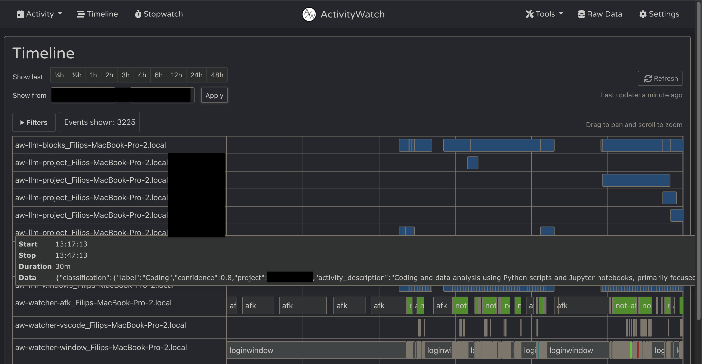

# aw-llm-worker

ActivityWatch worker with dual functionality:

1. **Time Summarization** (main feature) - Analyze ActivityWatch events and classify time blocks using text convolution
2. **Screenshot Classification** (optional) - multimodal LLM screenshot labeling



## Features

- Agregates aw events into 30 min windows and summarizes them using LLM
- Currently integrates with `aw-watcher-window`, `aw-watcher-afk`, `aw-watcher-vscode` and `aw-watcher-screenshot`
- Uses text convolution with keyword-based topic kernels for time classification (unstable)
- Automatically classifies screenshots from ActivityWatch watcher
- Uses Qwen2.5-VL-7B-Instruct (GGUF) with Metal GPU acceleration
- Intelligent project matching based on keywords
- Pushes structured classification events to ActivityWatch

## Installation

### Prerequisites

- macOS with Apple Silicon (M1/M2/M3)
- Python 3.12
- [uv](https://github.com/astral-sh/uv) package manager
- [ActivityWatch running](https://activitywatch.net/)
- [ActivityWatch Screenshots Watcher running](https://github.com/Srakai/aw-watcher-screenshot/)

### Install with Metal GPU Support

```bash
# Clone the repository
git clone <your-repo-url>
cd aw-llm-worker

# Install with uv (includes Metal compilation flags)
uv sync

# Or manually ensure Metal support
CMAKE_ARGS="-DLLAMA_METAL=on" uv pip install --reinstall --no-cache llama-cpp-python
```

### Download Models

Download the Qwen2.5-VL model and mmproj files:

```bash
# Default paths used by the worker:
# Model: ~/.cache/lm-studio/models/unsloth/Qwen2.5-VL-7B-Instruct-GGUF/Qwen2.5-VL-7B-Instruct-Q4_K_M.gguf
# MMProj: ~/.cache/lm-studio/models/unsloth/Qwen2.5-VL-7B-Instruct-GGUF/mmproj-F16.gguf

# You can download from Hugging Face:
huggingface-cli download unsloth/Qwen2.5-VL-7B-Instruct-GGUF \
  --local-dir ~/.cache/lm-studio/models/unsloth/Qwen2.5-VL-7B-Instruct-GGUF
```

## Usage

```bash
python aw_llm_worker.py \
  --mode summarization \
  --summarization-interval 6.0 \
  --lookback-hours 8 \
  --context topics.yaml
```

## Configuration

### Topics Configuration (YAML)

```yaml
topics:
  Coding:
    phrases: ["coding", "python", "vscode", "git", "terminal"]
    kernel_width: 15 # ~4 minutes at 15s resolution
    threshold: 0.3 # Minimum match score
    min_duration_s: 120 # 2 min minimum block
    merge_gap_s: 60 # Merge blocks within 60s

  Writing:
    phrases: ["writing", "docs", "obsidian", "notes"]
    kernel_width: 10
    threshold: 0.4
    min_duration_s: 180
    merge_gap_s: 60

projects:
  - name: "MyProject"
    keywords: ["myproject", "special-keyword"]
```

## Performance

With Metal GPU acceleration on M2 Apple Silicon:

- **Image encoding**: ~10-15 seconds
- **Classification**: ~18 tokens/second
- **Total per screenshot**: ~20-30 seconds

If you see slow performance (>60 seconds for encoding), ensure Metal support is properly compiled:

```bash
CMAKE_ARGS="-DLLAMA_METAL=on" uv pip install --reinstall --no-cache llama-cpp-python
```

## Output

### Summarization Bucket

- **Bucket**: `aw-llm-blocks_{hostname}`
- **Event Type**: `app.time.block`
- **Data Schema**:
  ```json
  {
    "classification": {
      "label": "Coding",
      "confidence": 0.75,
      "min_confidence": 0.65,
      "max_confidence": 0.85,
      "project": "aw-llm-worker",
      "activity_description": "Refactoring prompt templates and updating data models to include project detection"
    },
    "analysis": {
      "duration_minutes": 45.2,
      "num_windows": 9,
      "content_sample": "VSCode: classifier.py; Terminal: git commit; Chrome: Python docs...",
      "method": "llm_text_classification",
      "window_size_minutes": 30,
      "window_step_minutes": 5
    },
    "llm": {
      "model": "Qwen2.5-VL-7B-Instruct-Q4_K_M.gguf",
      "backend": "python",
      "temperature": 0.2,
      "max_tokens": 256,
      "method": "text_classification"
    },
    "config": {
      "merge_gap_s": 300,
      "min_confidence": 0.3,
      "lookback_hours": 8.0,
      "topics": ["Coding", "Writing", "Reading"]
    }
  }
  ```

### Screenshot Bucket

- **Bucket**: `aw-watcher-screenshot-llm_{hostname}`
- **Event Type**: `app.screenshot.label`
- **Data Schema**:

```json
{
  "src": {
    "path": "/path/to/screenshot.png",
    "sha256": "...",
    "app": "VSCode",
    "title": "...",
    "pid": 12345,
    "win_id": 6291463,
    "bbox": [0, 0, 1920, 1080]
  },
  "label": {
    "coarse_activity": "coding",
    "app_guess": "Visual Studio Code",
    "summary": "Working on Python script for screenshot classification",
    "tags": ["python", "vscode", "coding"],
    "project": {
      "name": "ActivityWatch Development",
      "confidence": 0.85,
      "reason": "keywords: activitywatch, python"
    },
    "confidence": 0.9
  },
  "llm": {
    "model": "Qwen2.5-VL-7B-Instruct-Q4_K_M.gguf",
    "mmproj": "mmproj-F16.gguf",
    "temperature": 0.2,
    "prompt_rev": "qwen2.5vl-screenshot-labeler/v1"
  },
  "context": {
    "context_id": "abc123...",
    "matched_keywords": "keywords: activitywatch, python"
  }
}
```

## Future Enhancements

- [ ] Topic discovery (unsupervised clustering)
- [ ] Multi-scale analysis (different time resolutions)
- [ ] Custom UI built from scratch
